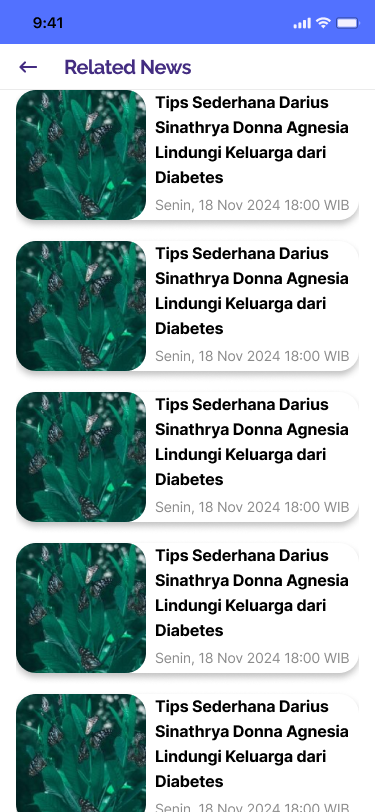

# C242-PS362_diabetes_risk_prediction

This repository are used for capstone project from grup id C242-PS362

| Nama                              | Student ID   | Path               | LinkedIn                                                                      |
| --------------------------------- | ------------ | ------------------ | ----------------------------------------------------------------------------- |
| Daniel Cahya Kurniawan            | C233B4KY0988 | Cloud Computing    | [Daniel Cahya Kurniawan](https://www.linkedin.com/in/daniel-cahya-kurniawan/) |
| Septian Ade Hidayat               | C007B4KY4104 | Cloud Computing    | [Septian Ade Hidayat](https://www.linkedin.com/in/septianadehidayat/)         |
| Irendra Lintang Keksi             | M283B4KX1998 | Machine Learning   | [Irendra Lintang Keksi](https://www.linkedin.com/in/irendra-lintang)          |
| Luthfiyyah Wahyu Nurfarida        | M283B4KX2311 | Machine Learning   | [Luthfiyyah Wahyu Nurfarida](https://www.linkedin.com/in/fiyyahwahyu)         |
| Muhamad Raffi Gumilang            | A288B4KY2651 | Mobile Development | [raffimrg](https://www.linkedin.com/in/raffimrg)                              |
| Muhammad Nur Iskandar Dzulqarnain | M200B4KY2978 | Machine Learning   | [Muhammad Nur Iskandar Dzulqarnain](https://www.linkedin.com/in/iskandardzz/) |
| Fahmi Hanafi                      | A288B4KY1347 | Mobile Development | [fahmi hanafi](https://www.linkedin.com/in/fahmi-hanafi/)                     |

## Overview 📃

Diabtic is a machine learning-driven application designed to assist users in predicting their risk of developing diabetes. The program analyzes health data such as BMI, blood pressure, cholesterol levels, and physical activity to provide personalized risk predictions and health insights.

## Support 🤔

For any issues or questions, feel free to reach out to the development team or refer to the comments within the code for guidance.

## Features 🚀

The application includes several features, such as:

- **User Authentication** Users can log in with their registered accounts on the application.
- **Home** The main page displays a status indicator as a green or red circle behind the profile picture. Green Indicates that the user is safe from diabetes, Red Indicates that the user should take precautions, as the application predicts a possible risk of diabetes.
- **Account Settings** Users can edit their account information if there are errors during registration.
- **Prediction** The main feature of the application allows users to predict diabetes risk by inputting specific data, including intensive parameters such as blood pressure, blood sugar, and cholesterol levels.
- **History** A supplementary feature that enables users to view prediction records over time, which are stored in a local database.
- **Articles** This feature provides news and updates about diabetes from various sources.
- **Dark/Light Mode** The app supports dark and light themes, following system settings.

## Tools and Technologies Used 🛠️

Here are some of the tools and technologies we used :

<p align="center">
<a href="#" target="blank"></a>
<a href="#" target="blank"></a>
<a href="#" target="blank"></a>
<a href="#" target="blank"></a>
<a href="#" target="blank"></a>
<a href="#" target="blank"></a>
<a href="#" target="blank"></a>
<a href="#" target="blank"></a>
<a href="#" target="blank"></a>
<a href="#" target="blank"></a>
<a href="#" target="blank"></a>
</p>

## Note For Replicate Our Steps 📝

**You can just clone our code**:

```bash
git clone https://github.com/raffiMRG/C242-PS362_diabetes_risk_prediction.git
```

**Usage Notes, Installation, and Task for Each Learning Path in Building This Application**:

[Machine Learning](https://github.com/raffiMRG/C242-PS362_diabetes_risk_prediction/blob/main/ML/README.md)

[Cloud Computing](https://github.com/raffiMRG/C242-PS362_diabetes_risk_prediction/blob/main/CC/README.md)

[Mobile Development](https://github.com/raffiMRG/C242-PS362_diabetes_risk_prediction/blob/main/MD/README.md)

## Result From Our Work 🎉

<p align="center">
<a href="IMG/Home.png" target="blank"></a>
<a href="IMG/Calculate.png" target="blank"></a>
<a href="IMG/History.png" target="blank"></a>
<a href="IMG/NewsList.png" target="blank"></a>
</p>
